## 概述

CloudFlare SAAS（自定义主机名）功能，核心是为类似“自助建站”等多用户分站平台提供服务，允许终端用户将其自有域名接入您的 CloudFlare 账户，而非直接解析到您的源站服务器。这提供了更好的安全性和管理性。

**本文目标：** 虽然 SAAS 常用于多用户分站场景，但本指南将聚焦于利用此功能，结合自选 CloudFlare IP 地址，为您的 **单个主网站域名** 提供服务。思路与传统分站逻辑不同。

* * *

## 准备工作

1\. **CloudFlare 账户：**

-   需要一个已注册的 CloudFlare 账户。
    
-   **关键要求：** 必须通过 PayPal 或海外银行卡验证支付方式，以开通 **CloudFlare for SaaS（自定义主机名）** 功能。
    

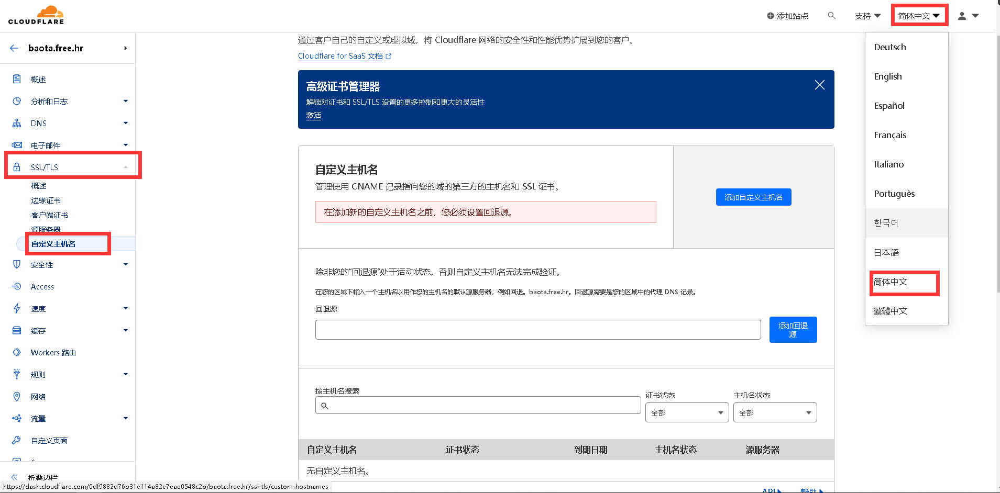

2\. **网站域名：**

-   这是您实际用于建站并希望使用自选 IP 的域名（例如 `www.yourname.com`, `yourname.com`）。
    
-   **重要限制：** 此域名的 **DNS 解析服务器不能使用 CloudFlare**。使用 CloudFlare DNS 会导致 CDN 配置冲突。
    
-   **注意：** `www.yourname.com` 和 `yourname.com` 被视为两个不同的主机名（网站）。
    
-   **本文示例：** 我们将使用 `www.mufeng.xyz`（其 DNS 解析托管在**Spaceship**）。
    

3\. **回源域名：**

_此域名的_ **NS 记录必须接入 CloudFlare**，由 CloudFlare 完全管理其 DNS。因此它**不能**用于自选 IP。

-   **选择建议：**
    
    -   如果需要接入大量网站域名，请选择您计划长期持有的域名。
        
    -   避免使用“年抛”域名，到期迁移会很麻烦。
        
    -   可以考虑价格低廉且可续费多年的域名（如 6 位数字 `.xyz`）。
    
-   **兼容性：** 并非所有域名后缀都支持 NS 接入 CloudFlare。
    
-   **本文示例：** 使用 `137508.xyz` 作为回源域名
    

* * *

## 配置步骤

### 1\. 将回源域名 NS 接入 CloudFlare

> 如果您的回源域名已在 CloudFlare 通过 NS 方式管理，请跳过此步。

1\. 在 CloudFlare 账户中添加您的回源域名（示例`137508.xyz`）。

2\. 添加完成后，CloudFlare 会提供其专属的 **NS 服务器地址**。复制这些地址。

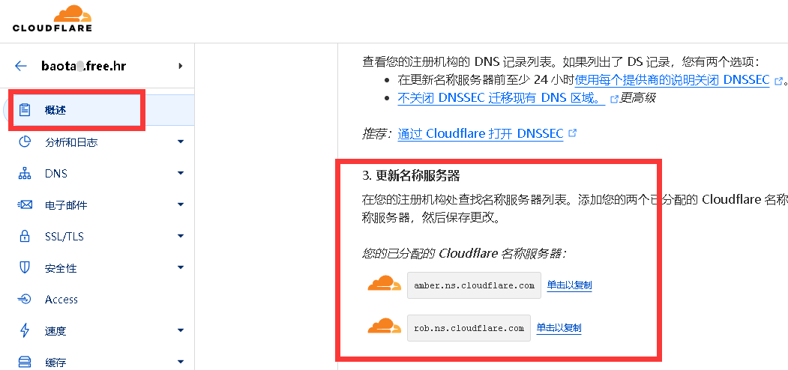

3\. 登录您的回源域名注册商控制面板，将域名的 **NS 记录更新**为 CloudFlare 提供的地址。

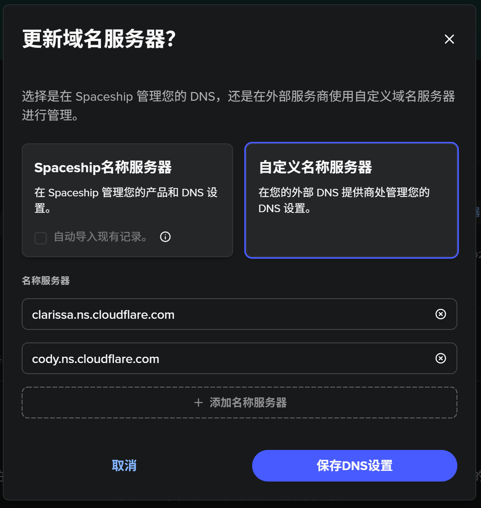

4\. 等待 NS 更改生效（通常需要几小时，最多 48 小时）。您也可以在 CloudFlare 界面查看状态。

### 2\. 配置网站域名的 DNS

_确保您的网站域名（示例_`www.mufeng.xyz`_）的 DNS 解析托管在_ **非 CloudFlare** 的服务商（如spaceship、阿里云、Cloudflare 以外的其他 DNS 提供商）。

-   在后续步骤中，您需要在此 DNS 服务商处添加验证记录和解析记录。
    

### 3\. 在回源域名下创建回退源地址

1\. 在 CloudFlare 控制面板中，进入您的**回源域名**`137508.xyz`）的 **DNS 设置**。

2\. 点击 **添加记录**。

3\. 选择记录类型为 `A` 或 `CNAME`。

-   **名称：** 填写一个子域名前缀（如 `source`）。建议使用子域名而非根域名`@`）。
    
-   **IPv4 地址 / 目标：** 填写您源站服务器的 **公网 IP 地址**（示例`111.111.111.111`）。如果是 `CNAME`，则填写您的源站地址。
    
-   **代理状态：务必开启（橙色云朵图标）**。关闭此状态会导致所有通过自定义主机名接入的流量直接回源，绕过 CloudFlare CDN 保护。
    
-   **TTL：** 保持默认（自动）即可。
    

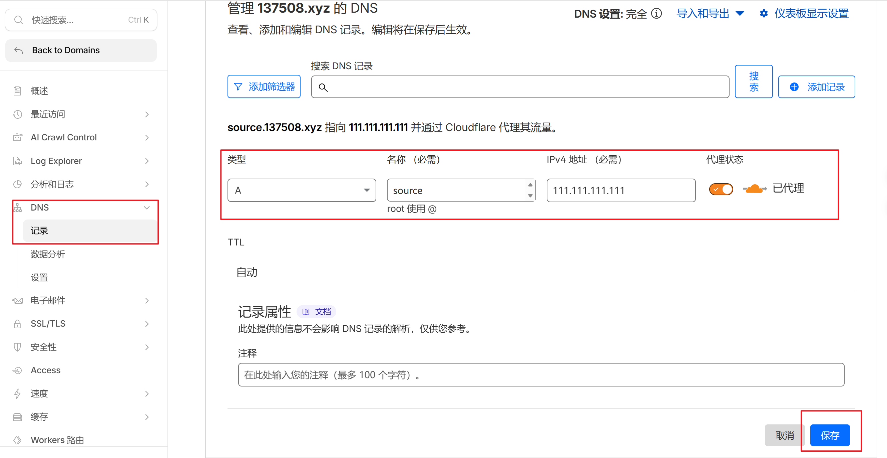

4\. 点击 **保存**。此记录创建了我们的回退源地址（示例`source.137508.xyz` -> `111.111.111.111`）。

### 4\. 在自定义主机名中添加回退源地址

1\. 回到 CloudFlare 账户首页，进入 **SSL/TLS** -> **自定义主机名**。

2\. 在 **回退源** 部分，点击 **添加回退源**。

3\. 输入您在上一步创建的 **回退源地址**（示例`source.137508.xyz`）。

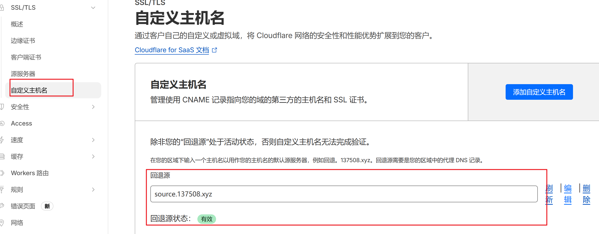

4\. 点击 **添加回退源**。

### 5\. 添加网站域名（自定义主机名）

1\. 确保回退源状态正常（可能需要短暂等待），然后点击右上角的 **添加自定义主机名**。

> 自定义主机名不建议使用一级域名（根域名），可能无法使用

2\. 在 **自定义主机名** 输入框中，填写您要接入的 **网站域名**（示例`www.mufeng.xyz`）。您可以添加多个（如 `www.yourname.com`, `yourname.com`）。

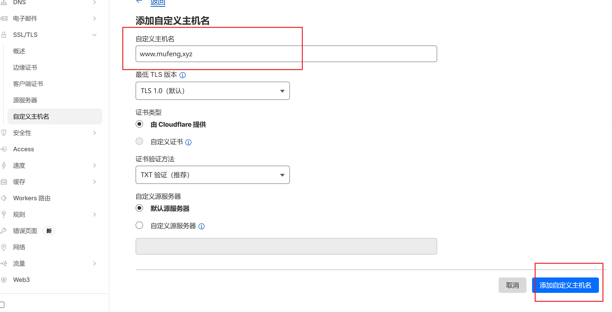

3\. 点击 **添加自定义主机名**。

### 6\. 证书验证（DCV 委派验证方式）

> CloudFlare 提供两种证书验证方式：
> 
> \* **TXT 解析验证：** 使用TXT记录解析验证的方式，可能不会自动续签。
> 
> \* **DCV 委派验证：** 使用cname的方式解析到指定dcv地址，以便自动化颁发续订证书。本文采用此方式。

1\. CloudFlare 会生成 **DCV 委派验证** 信息。**复制提供的值**（示例`www.mufeng.xyz.37e146ded7398f52.dcv.cloudflare.com`）。

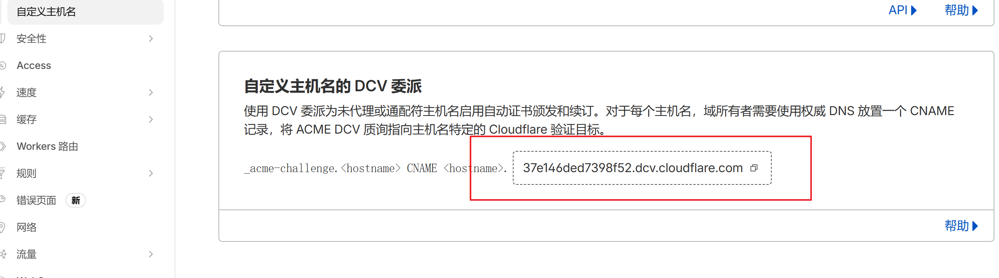

2\. 登录您的**网站域名**的 DNS 托管服务商控制面板（示例：Spaceship）。

3\. 添加一条 `CNAME`记录：

-   **主机名：** 根据您添加的网站域名格式填写：
    

_如果是_ **根域名**（如 `yourname.com`）：主机名填写 `_acme-challenge`

_如果是_ `www` **子域名**（如 `www.yourname.com`）：主机名填写 `_acme-challenge.www`

_如果是_ **其他子域名**（如 `web.ba.me`）：主机名填写 `_acme-challenge.www` （这里的 `www` 对应子域名前缀）

-   **值/目标：** 粘贴从 CloudFlare 复制的 DCV 委派值（示例`www.mufeng.xyz.37e146ded7398f52.dcv.cloudflare.com`）。
    
-   **TTL：** 保持默认或设置较低值（如 300 秒）。
    

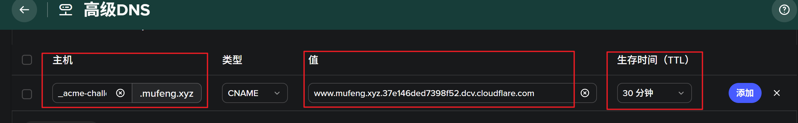

4\. 保存 DNS 记录。

### 7\. 为网站域名添加解析记录指向回退源

1\. 仍在您的**网站域名**的 DNS 托管服务商处。

2\. 添加一条 `CNAME`记录：

-   **主机名：** 填写您的网站域名的主机部分（如 `www` 对应 `www.mufeng.xyz` ；`@` 通常对应根域名 `yourname.com`）。
    
-   **值/目标：** 填写您在 **步骤 3** 创建的回退源地址（示例`source.137508.xyz`）。
    
-   **TTL：** 保持默认或设置合理值。
    

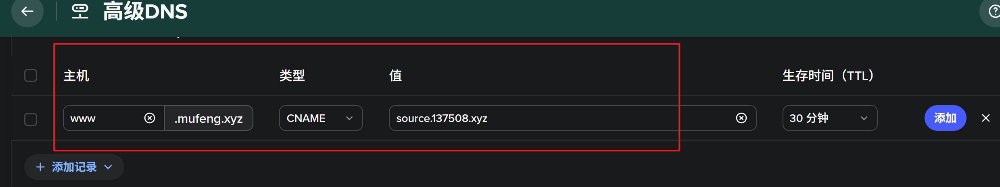

3\. 保存 DNS 记录。

### 8\. 主机名验证（实时验证方式）

> CloudFlare 提供两种主机名验证方式：
> 
> \* **预验证 (TXT/HTTP)：** 需要等待 CloudFlare 扫描，时间较长。
> 
> \* **实时验证 (CNAME)：** 要求网站域名正确 `CNAME` 指向回退源地址（即上一步配置），验证速度更快。本文采用此方式。

1\. 为了**加速验证过程**，使用一个外部工具（如 \[[ITDOG](https://www.itdog.cn/)\]）访问一次您的**网站域名**（示例`www.mufeng.xyz`）。这会产生一个真实的 DNS 查询和连接请求，帮助 CloudFlare 快速检测到配置。

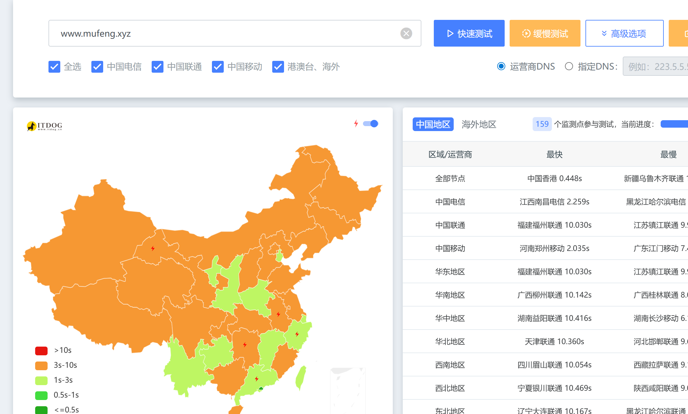

### 9\. 检查验证状态

1\. 返回 CloudFlare 控制面板的 **SSL/TLS -> 自定义主机名** 页面。

2\. **刷新** 页面。

3\. 正常情况下，您添加的网站域名状态应很快变为 **有效**（可能显示绿色对勾或“Active”）。

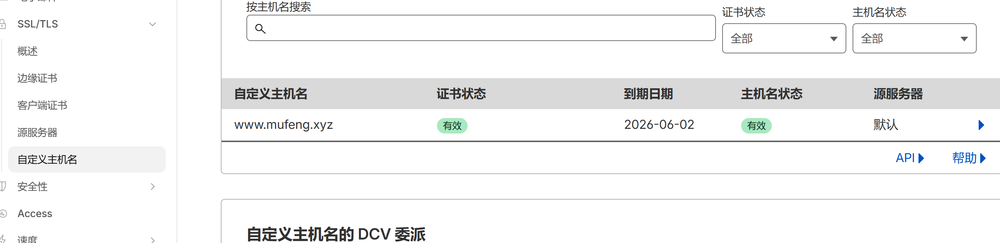

4\. 如果状态未更新，请耐心等待几分钟，或仔细检查上述所有步骤（特别是 DNS 记录是否配置正确且已生效）。

* * *

## 完成

至此，您的网站域名 `www.mufeng.xyz`) 已成功通过 CloudFlare SAAS 功能接入，流量将经由您配置的 CloudFlare 节点（未来可在此架构基础上实现自选IP）到达您的源站服务器 `111.111.111.111`)，并享受 CloudFlare 提供的 CDN 加速和安全防护。请确保源站服务器已正确配置以接受来自 CloudFlare IP 的流量并响应 `www.mufeng.xyz` 的请求。

> 此文章搬运自[https://www.baota.me/post-413.html](https://www.baota.me/post-413.html)